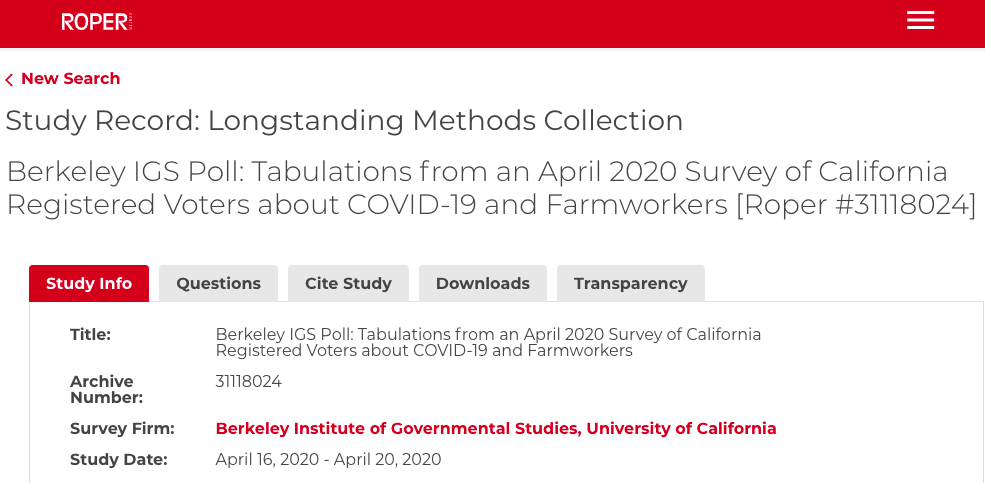

# Data Case Study 2

Take a look at the landing page for the dataset:<br>
**Berkeley IGS Poll: Tabulations from an April 2020 Survey of California Registered Voters about COVID-19 and Farmworkers** <br>
[https://doi.roper.center/?doi=10.25940/ROPER-31118024](https://doi.roper.center/?doi=10.25940/ROPER-31118024)



With the information shown above, and using the link provided, answer the following questions:

## Background

**Questions**

1. Why was the data collected?
2. What are the limitations of the data?

## Publisher / Host

**Questions**

1. How do you access the dataset? 
2. Is there a theme or subject focus to the repository?
3. What other types of data would you expect to find there?
4. Find the “Transparency” tab in the dataset record. What does this information show and why might it be important?

## Citation

````{card}
**Questions**

1. How would you cite the data?
2. Is there an example or recommendation?

```{dropdown} Result
Berkeley Institute of Governmental Studies, University of California. (2020). Berkeley IGS Poll: Tabulations from an April 2020 Survey of California Registered Voters about COVID-19 and Farmworkers (Version 3) [Dataset]. Cornell University, Ithaca, NY: Roper Center for Public Opinion Research. doi:10.25940/ROPER-31118024
```
````

## Licensing

**Questions**

1. Are you allowed to disseminate this dataset?
2. How do you know?
