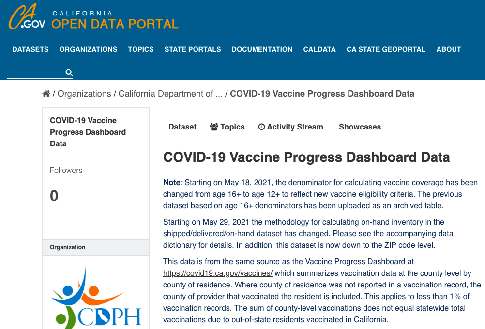

# Data Case Study 4

Take a look at the landing page for the dataset:<br>
**COVID-19 Vaccine Progress Dashboard Data** <br>
[https://data.ca.gov/dataset/covid-19-vaccine-progress-dashboard-data](https://data.ca.gov/dataset/covid-19-vaccine-progress-dashboard-data)



With the information shown above, and using the link provided, answer the following questions:

## Background

**Questions**

1. Why was the data collected?
2. What are the limitations of the data?

## Publisher / Host

**Questions**

1. Where is the data hosted?
2. When was the data last updated? 
3. What data is excluded and why?
4. What other types of data would you expect to find there?

## Citation

````{card}
**Questions**

1. How would you cite the data?
2. Is there an example or recommendation?

```{dropdown} Result
California Department of Public Health (2021), COVID-19 Vaccine Progress Dashboard Data, California Open Data Portal, https://data.ca.gov/dataset/covid-19-vaccine-progress-dashboard-data
```
````
## Licensing

**Questions**

1. Are you allowed to reuse this dataset?
2. How do you know?
