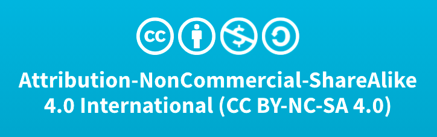

# Data Case Study Example

Take a look at the landing page for the dataset:<br>
**Mapping Inequality: Redlining in New Deal America**<br>
**Oakland/Berkeley/Emeryville greater area**<br>
Source: [Mapping Inequality - University of Richmond’s Digital Scholar Lab](https://dsl.richmond.edu/panorama/redlining/#loc=12/37.81/-122.324&city=oakland-ca) and [T-RACES (Testbed for the Redlining Archives of California’s Exclusionary Spaces](http://t-races.net/T-RACES/)


With the information shown above, and using the links provided, answer the following questions:

## Background

### Questions

1. Why was the data collected?
2. What are the limitations of the data?

```{dropdown} Answer
        
1. Why was the data collected? <br>   
    The data was collected by the National Home Owner’s Loan Corporation (HOLC) in 1933 as part of the New Deal. HOLC worked with banks to assess real estate to determine the “credit-worthiness” of potential homeowners based on zipcode. HOLC filled in information about sections that included: 
    - Inhabitants (undesirables)
    - Foreign born
    - “Negro”
    - Type (e.g. business man, retired capitalist, etc.)
    - Favorable influences
    - Detrimental influences <br>
    
    Based on each assessment, a neighborhood was assigned a grade. An “A” grade neighborhood, represented by the color green and inhabited by white people, signified a minimal risk for banks and mortgage lenders. Neighborhoods that received a “D” grade, represented by the color red and inhabited by BIPOC Americans, signified a high risk, enabling lenders to refuse loans for homes in redlined neighborhoods. The inhabitants of redlined neighborhoods, Black Americans, Asian Americans, and other people of color, were intentionally denied mortgages, which prevented them from acquiring and building wealth through property - a denial that had deleterious effects on many BIPOC Americans for generations to come. 
    
2. What are the limitations of the data? <br>       
    The data describes neighborhoods and zipcodes based on a predetermined set of characteristics to determine funding. These characteristics (except for the description of terrain) are racist and discriminatory. 
    - Description of terrain
    - Inhabitants (which inludes type, estimated annual family income, foreign-born; and Negro)
    - Buildings
    - History of sale values and rental values
    - Trend of desirability next 10-15 years
    - Clarifying remarks

```

## Publisher / Host

### Questions

1. Where is the data hosted?
2. Is there a theme or subject focus to the repository?
3. What other types of data would you expect to find there?

```{dropdown} Answer
  
1. Where is the data hosted? <br>
Digital Scholarship Lab at the University of Richmond <br>
2. Is there a theme or subject focus to the repository? <br>
The DSL at University of Richmond is not technically an archive, but the official website for DHL at University of Richmond. The focus is digital humanities projects. <br>
3. What other types of data would you expect to find there? <br>
Users may find other digital humanities projects that explore race and racism, history, and other topics in the social sciences.
```

## Citation

### Questions

1. How would you cite the data? Is there an example or recommendation?

```{dropdown} Answer

Robert K. Nelson and Edward L. Ayers, accessed [INSERT TODAY’S DATE], https://dsl.richmond.edu/panorama/redlining/[YOUR VIEW].

```

## Licensing

### Questions

1. Are you allowed to reuse this dataset?
2. What does this mean?

```{dropdown} Answer
   
1. Are you allowed to reuse this dataset? <br>
Yes! The data has a [CC-BY-NC-SA](https://creativecommons.org/licenses/by-nc-sa/4.0/) license. <br>
<br>

2. What does this mean? <br>
You are free to share (copy and redistribute the material in any medium or format) and adapt (remix, transform, and build upon the material) under the following terms: 
Attribution (give appropriate credit, link to the license and indicate if changes were made)<br>
You may not use the material for commercial purposes<br>
If you remix, transform, or build upon the material, you must distribute your contributions under the same license. 
```
