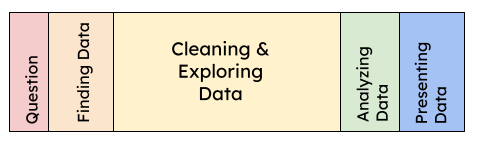
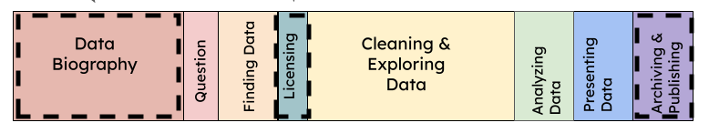
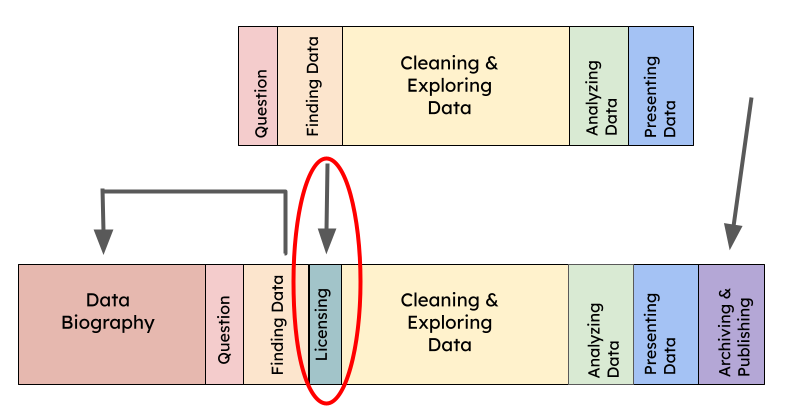
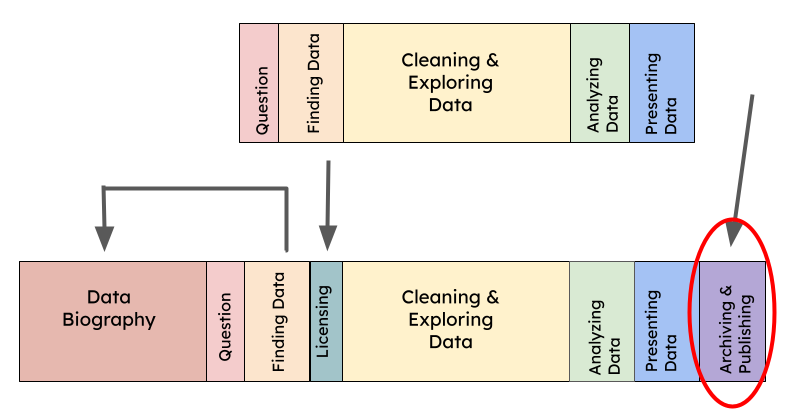

# Understanding Data

Beginning a data-focused project can be daunting! This section will help you: 

1. Interpret why data was collected and examine its perceived limitations
2. Understand the basics of data licensing and access
3. Identify issues that may aid or hinder reproducibility 
4. Know where to get started with finding data

## Data Analysis

A typical **Data Analysis** approach takes the following path:

Here, we invite you to consider the addition of three components, **Data Biography**, **Licensing**, and **Archiving and Publishing**, each marked in the revised approach below:

### Data biography

1. Who collected the data?
2. How did they collect it?
3. For what purpose?
4. How is it used? By whom?
5. What are its impacts? On whom?
6. What are the known limitations?

### Licensing

1. How can you use data?
2. How do you know?

At a minimum, generate a **citation** for the data that you will use.  
Find a **license**. If there is a license, what does it mean?  

Consult [Creative Commons](https://creativecommons.org/about/cclicenses/) to learn about licenses and their implications. 

Regardless of the license, always include a citation.  

### Archiving and Publishing

For more information about archiving and publishing options, consult the section on [Archival Repositories](https://eps-libraries-berkeley.github.io/volt/Data/What_is_a_repository.html).

{cite}`d2017creative` 
Data Biography and Data Analysis Images based on: Catherine D’Ignazio. Creative data literacy: bridging the gap between the data-haves and data-have nots. Information Design Journal, 23(1):6–18, 2017.
