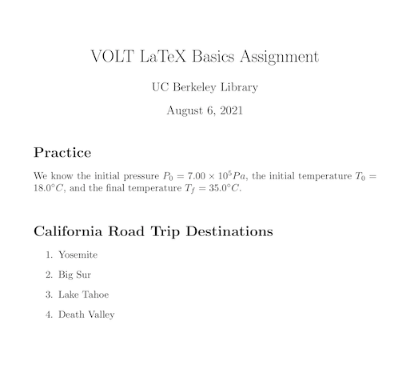
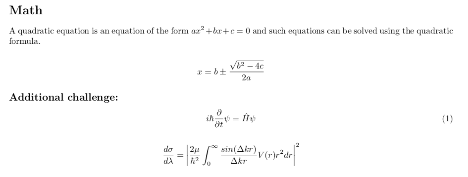

# Introduction to LaTeX Workshop

## LaTeX Basics

### Introduction
LaTeX is a typesetting system that allows you to focus on your content instead of formatting - formatting is done separately from entry.

You tell LaTeX “what it is” not “how it looks.”

### LaTeX using Overleaf
- Create documents via a cloud based account
- Source code or rich text format
- Collaborating and sharing documents
- Versioning and track changes
- Templates for a variety of documents and publishers
- Link with other tools in your research workflow
- Pro account with your *berkeley.edu* address

### Example
Look at the template below to get a sense of how Overleaf works. On the left side, the content is written in LaTeX. On the right side, the rendered document.

```{image} ./images/template.png
:alt: two panel view of Overleaf platform
:width: 500px
:align: center
```

### Structure of a document

| Term | Description | Example |
|-|-|-|
| Command | Control sequence which performs an action | `\\newpage`|
| Preamble | Block of commands that define the type of document you are writing,  the language you are writing in, the packages you would like to use. Comes before \\begin{document}| `\\documentclass{article}`|
| Package | Enable you to create bibliographies, insert images and figures, and write formulas. | `\\usepackage{amsmath}` |
| Environment | Block of code with specific behavior depending on its type | `\\begin{}` & `\\end{}` |
| Body | Content of document enclosed inside an environment | `\\begin{document}` |

:::{note}
- Comments: Use % to create a comment. Nothing on the line after the % will be typeset.
- Restricted Characters: Certain symbols require a backslash to appear, like $, &, #, and %.
:::

### Basic Commands
- *Bold*: \textbf{example}
- _Italics_ : \textit{example}
- {u}`Underline`: \underline{example}

Font typefaces:
Change font designations in preamble. More information:\
https://v2.overleaf.com/learn/Font_typefaces

### Make Title
The simplest option for making a title is to use the \maketitle command which draws from the following declarations within the preamble:
\author
\date
\thanks
\title

### Lists
Use the \begin{itemize}...\end{itemize} environment to create unnumbered lists.

:::{hint}

```
\begin{itemize}
\item Apples
\item Cherries
\item Oranges
\item Peaches
\item Watermelon
\end{itemize}
```
---

This code results in:

- Apples
- Cherries
- Oranges
- Peaches
- Watermelon

:::

Use the \begin{enumerate}...\end{enumerate} environment to create numbered lists.

### Packages and Accessible PDFs

The steps for creating an accessible PDF begin when you initiate a new project.
Add the text below to enable tagging essential for an accessible PDF.

```
\DocumentMetadata{tagging=on,
    tagging-setup={math/setup=mathml-SE},
    pdfstandard=ua-2,
    lang=en-US
}
```

Read more:
- Information from Overleaf on *Creating accessible PDFs in LaTeX*:\ https://docs.overleaf.com/writing-and-editing/creating-accessible-pdfs
- More indepth documentation from the LaTeX Tagging Project:\ https://latex3.github.io/tagging-project/documentation/usage-instructions

Instructions for accessibility requirements related to images or figures follow below.

### Exercise

:::{Exercise}

**Exercise 1: Basic LaTeX Commands**

*Objective: Practice several basic LaTeX commands in a new project.*

1. Open a new project in [Overleaf](https://www.overleaf.com/edu/berkeley). \
2. Create Title \
- After `\title`, add "VOLT LaTeX Basics Assignment" \
- After `\author`, add your name \
- Confirm that the date is correct or edit if needed\ 
- Display **Title** using command `\maketitle` inserted after `\begin{document}` \
3. Add a new section labeled "Practice" using the `\section*` command. \
4. Add a new section labeled "California Road Trip Destinations"" \
5. Make a numbered list of four items, for example: \
  Yosemite \
  Big Sur \
  Lake Tahoe \
  Death Valley \

```{hint}
*Commands needed:* `\section*{}`, `\\begin{enumerate}...\\end{enumerate}`.

:::{note} Results
:class: dropdown
This is how your rendered exercise should appear in Overleaf.\

:::

:::{note} Questions?
:class: dropdown
Compare your LaTeX code to the <a href=\"https://www.overleaf.com/read/djdcymcpxcxq\">solutions</a> to troubleshoot. 
:::

:::

## Mathematics and Equations

### Simple Operators, Subscripts, Superscripts & More

To render simple equations, you also need to know syntax and commands for operators, relations, subscripts, superscripts, and fractions.\

#### Operators \\& Relations:
+, -, =, >, < work as expected. Here are some other commands:\

| Command | Display | 
| :---: | :---: | 
| `\times` | $\times$ | 
| `\div` | $\div$ | 
| `\geq` | $\geq$ |
| `\neq` | $\neq$ |
| `\pm` | $\pm$ |
| `\leq` | $\leq$ |
| `\cdot` | $\cdot$ | 
| `\approx` | $\approx$ |

### Basic Math
To display math inline with text, place formula or symbol in between $:

`$x + y = z$` renders inline: $x + y = z$ \

Display mode `\[ x + y = z \]` or `$$ x + y = z $$` will center the equation on its own line: \
x + y = z

 
**Subscript:** use the underscore (_) / **Superscript**: use the carret (^)\ 

:::{note}
If the subscript or superscript includes more than one character, enclose it in curly brackets--otherwise the command applies only to the first character. 

**Example:** `$x^n+1$` gives $x^n+1$ but `$x^{n+1}$` gives $x^{n+1}$ \ 
:::

**Fractions:** \ 

To display a fraction, use the command `\frac` followed by the numerator and denominator in curly brackets. \ 
**Example:** `\frac{1}{x}` gives $\frac{1}{x}$

### Next Steps: Greek Letters, Integrals & More

#### Greek Letters

Many equations and formulas use Greek letters. The command is simple - just the backslash and the name of the letter. Capitalize the command to get the capital letter. Here are some examples: \ 

| Command | Display | Command | Display | Command | Display |
| --- | --- | --- | --- | --- | --- |
| `\alpha` | $\alpha$ | `\lambda` | $\lambda$ | `\rho` | $\rho$ |
| `\beta` | $\beta$ | `\Lambda` | $\Lambda$ | `\sigma` | $\sigma$ |
| `\Gamma` | $\Gamma$ | `\mu` | $\mu$ | `\\hi` | $\Phi$ |
| `\delta` | $\delta$ | `\pi` | $\pi$ | `\omega` | $\omega$ | 
| `\Delta` | $\Delta$ ||| `\Omega` | $\Omega$ |

Greek letters that are the same in English are an exception, for example, use A for Alpha, B for Beta, Z for Zeta. For more commands, see the Overleaf <a href=\"https://www.overleaf.com/learn/latex/List_of_Greek_letters_and_math_symbols#Greek_letters\">list of Greek letters</a>.\ 

:::{seealso} More help with Greek letters and Symbols
Apart from hand-coding Greek letters and other symbols, Berkeley's premium subscription allows us to take advantage of the <a href=\"https://www.overleaf.com/blog/new-feature-find-symbols-quicker-with-our-new-symbol-palette-for-premium\">Overleaf Symbol Palette</a>. The Symbol Palette helps you quickly find commonly used symbols, and will also tell you which packages you need to use them. \ 
:::

### Limits & Integrals

There are also commands for common operations that take upper and lower bounds:\ 

**Limits:**

```
\[
lim_{x \\to \\infty} f(x) \ 
\]
``` 
results in \ 

$$ lim_{x \\to \\infty} f(x) $$ \ 

**Integrals:**

```
\[  
\int_{a}^{b} x^2 dx \ 
\]  
```

results in \ 
$$ \int_{a}^{b} x^2 dx $$

### More Advanced: Math Packages

### *amsmath* & *amssymb* Packages

LaTeX has many packages that you can use to extend its capabilities. The *amsmath* and *amssymb* packages provide you with additional symbols and commands for structuring equations.\ 

To include them, add these commands to the preamble of your LaTeX document: \ 
`\usepackage{amsmath}` \
`\usepackage{amssymb}` \

### *amsmath*: Equations Environment

Use the `\\begin{equation}...\\end{equation}` command to include a numbered equation in display mode. \ 

```
\begin{equation}
\frac{\\partial Q}{\\partial t} = \\frac{\\partial s}{\\partial t}
\end{equation}
```
results in
```{math}
:label: partial equation example
\frac{\\partial Q}{\\partial t} = \\frac{\\partial s}{\\partial t}\ 
```

:::{note}\ 
Use `\begin{equation*}` for unnumbered equations.\
:::

### Exercise

:::{Exercise 2: Mathematical Equations}
*Objective: Experiment with mathematical notations in LaTeX.* \ 

1.Add the following paragraph under that section using "inline" math commands: \

"We know the initial pressure $P_0 = 7.00 \\times 10^5 Pa$, the initial temperature $T_0 = 18.0 ^{\circ}C$, and the final temperature $T_f = 35.0 ^{\circ}C$." \"

2. Recreate this text in your document: \ 
A quadratic equation is an equation of the form $ax^2 + bx + c = 0$ and such equations can be solved using the quadratic formula:

```{math}
x = \\frac{-b \\pm \\sqrt{b^2 - 4ac}}{2a}
```

:::{hint}
Commands needed: `\\frac{}{}`, `\\pm`, `\\sqrt{}`, `\\[...\\]` or `$$...$$` 
:::

:::{note} **Additional challenges**
:class: dropdown

Recreate this equation in your document: 
```{math}
i\hbar\frac{\partial}{\partial t}\psi = \hat{H}\psi 
```
:::

:::{hint}
    "Commands needed: `\partial`, `\psi`, `\hbar`, `\hat{H}`<br>\ 
    "Packages needed: `\usepackage{amsmath}`, `\usepackage{amssymb}`<br>\ 
    "Environment needed: `\begin{equation*} ... \end{equation*}`<br>\ 
:::

Recreate this equation in your document: 
```{math}
\frac{d\sigma}{d\lambda}= \left|\frac{2\mu}{\hbar^2}\int_{0}^{\infty}\frac{sin(\Delta kr)}{\Delta kr}V(r)r^2dr\right|^2
```
    
:::{hint} 
Commands needed: `\infty`, `\sigma`, `\lambda`, `\mu`, `\\elta`, `\left|`, `\right|` \
Environment needed: `\begin{equation*} ... \end{equation*}` \
:::

:::

:::{dropdown} **Results**
This is how your rendered exercise should appear in Overleaf. 

:::

 